# Hermes Core Skills

<div align="center">

[](https://github.com/chrislamlayer1-gif/hermes-core-skills/stargazers)
[](https://github.com/chrislamlayer1-gif/hermes-core-skills/forks)
[](https://opensource.org/licenses/MIT)
[](https://github.com/chrislamlayer1-gif/hermes-core-skills)
[](https://claude.ai)
[](https://codex.chat)
[](https://cursor.sh)
[](https://github.com/NousResearch/hermes-agent)

</div>

**Your AI coding agent keeps doing dumb things? Here's the fix.**

---

## 😤 You've been there:

- **#1** Agent does `/clear` and forgets everything — you re-explain from scratch
- **#2** Agent sees "fix this bug" and starts changing code — one fix, three new bugs
- **#3** Token burns fast — $5 gone before lunch, and you don't know why
- **#4** Context fills up and agent starts forgetting what you said 5 minutes ago
- **#5** Agent pushes code changes without asking — you only find out when it breaks

**This pack of 25 executable skills fixes all of that.** Not vague advice. Step-by-step workflows your agent loads and follows.

<div align="center">

## 🎬 Demo

*Watch the full 30-second quick install — click to play!*



*SVG animation — works everywhere, no loading time, scales perfectly.*

</div>

---

## 🚀 Quick Start (30 seconds)

```bash
cp -r skills/* ~/.claude/skills/   # Claude Code
cp -r skills/* ~/.cursor/skills/   # Cursor
cp -r skills/* ~/.codex/skills/    # OpenAI Codex
# Hermes Agent: auto-dispatched from ~/.hermes/skills/
```

**Then tell your agent:** *"Use the systematic-debugging skill to help me with this error."*

---

## 💡 Why These Skills?

### The problem

AI coding agents are powerful, but they have a fatal flaw: **they don't know how to work safely yet**. Without guidance, an agent will:

- Burn through your token budget in minutes
- Fix one bug and introduce three more
- Push code changes without asking
- Forget context after every `/clear`
- Loop forever on the same error

### The solution

These 25 skills are executable workflows that teach your agent **how to behave** — systematic debugging, token-aware planning, self-regulation, and safety nets. They're not vague advice; they're step-by-step instructions your agent follows automatically.

---

## 🆚 How This Compares

| Feature | Hermes Core Skills | LangChain Agents | Manual Prompting |
|---------|-------------------|------------------|-------------------|
| Drop-in ready | ✅ Copy and use | ❌ Requires code integration | ❌ Write prompts yourself |
| Executable workflows | ✅ Agent follows step by step | ❌ Just a framework | ❌ No structure |
| Cross-platform | ✅ Claude / Codex / Cursor / Hermes | ❌ Python only | ✅ Any agent |
| Token-aware | ✅ Built-in efficiency rules | ❌ No token optimization | ❌ No token optimization |
| Self-regulation | ✅ Brake system, stall detection | ❌ Not available | ❌ Not available |
| Open source | ✅ MIT | ✅ MIT | ✅ Free |

Hermes Core Skills is not a framework you integrate — it's a **workflow layer** your agent loads. It works alongside any agent and any framework.

---

## 💬 Example: How to Use These Skills

### Scenario 1: Your agent keeps making bugs worse

```
You: "Use the systematic-debugging skill on this error: TypeError: Cannot read ..."
Agent: [Loads the 4-stage workflow]
  1. Report — captures the full error context
  2. Context — reads affected files
  3. Hypothesis — identifies root cause
  4. Fix — only applies change after root cause is confirmed
Result: One fix, zero new bugs.
```

### Scenario 2: You're tired of surprise token bills

```
You: "Follow the token-efficiency skill for this task."
Agent: [Loads token-saving rules]
  - Compresses long context before proceeding
  - Delegates heavy research to sub-agents
  - Avoids wasteful pattern loops
Result: Uses 40-60% fewer tokens.
```

### Scenario 3: Complex project needs multiple features

```
You: "Run subagent-driven-development to implement the auth system."
Agent: [Splits into parallel sub-agents]
  - Sub-agent 1: Login page
  - Sub-agent 2: JWT middleware
  - Sub-agent 3: Database schema
  - Review pass: merges all, fixes conflicts
Result: Features built in parallel, completed faster.
```

---

## ✨ Highlight Skills

| Skill | One-liner | Problem it solves |
|-------|-----------|-------------------|
| **systematic-debugging** | No root cause, no fix | Agent randomly patches bugs, making things worse |
| **self-regulation-brake-system** | Force stop after 3 failures | Agent looping forever, burning your budget |
| **writing-plans** | Write a plan before touching code | Agent builds the wrong thing, needs redo |
| **subagent-driven-development** | Split into subagents, review after | Complex tasks overwhelm a single agent's context |
| **token-efficiency** | Every token counts | End-of-month surprise bills |
| **checkpoints-and-rewind** | Auto-backup before any change | Agent destroys a file, can't recover |

---

## 📋 What's Inside

### 🧠 Agent Core (13 skills)

| Skill | Role | Pain Point | Highlight |
|-------|------|-----------|-----------|
| **self-regulation-brake-system** | Agent seatbelt | Agent crashes and keeps burning tokens when you're away | 3-fail stop, 5-min stall report, no bypass allowed |
| **systematic-debugging** | Your Sherlock Holmes | Agent randomly patches bugs, one fix creates three more | 4-stage: Report → Context → Hypothesis → Fix. Iron rule: no root cause, no fix |
| **writing-plans** | Your project manager | Agent builds in wrong direction, discovers at the end | Bite-size tasks, exact file paths, code + test per task |
| **spec-driven-development** | Your requirements doctor | Unclear requirements, builds the wrong thing | Write spec first, no coding without understanding |
| **test-driven-development** | Your quality gate | Agent says "done" but never actually tested | RED-GREEN-REFACTOR, no tests = not done |
| **subagent-driven-development** | Your team lead | Complex task doesn't fit in one agent context | Split tasks → fresh subagent each → review → merge |
| **requesting-code-review** | Your code reviewer | Agent commits bad code, you don't know | Security scan + quality gate + independent reviewer |
| **security-hardening-checklist** | Your security advisor | Agent doesn't know secure coding, leaves vulnerabilities | Input, auth, storage, third-party, item by item |
| **think-tool** | Your rational voice | Agent makes impulsive decisions without thinking first | Pros cons + trade-offs + risk analysis framework |
| **token-efficiency** | Your CFO | Token burn rate is scary, don't know how to save | Context compression, delegate strategy, waste pattern avoidance |
| **checkpoints-and-rewind** | Your undo button | Agent corrupts a file, can't roll back | Auto-backup, snapshot, rollback before any change |
| **context-aware-task-decomposition** | Your context doctor | Context full, agent starts forgetting | Auto-decompose tasks, never hit context limit |
| **context-compaction-verification-and-recovery** | Your memory detective | After compaction, agent doesn't remember what it did | Verify tool commands actually executed |

### 🤖 AI Agent Ecosystem (6 skills)

| Skill | Role | Pain Point | Highlight |
|-------|------|-----------|-----------|
| **agent-capability-comparison-methodology** | Your agent buyer | Don't know which agent is good, marketing lies | Source code + benchmark + hands-on, three-layer verification |
| **open-source-adaptation-pattern** | Your technical due diligence | Install an OSS project, find out it doesn't fit | License + maintenance + community + actual need, four-dimension eval |
| **multi-agent-browser-text-extraction** | Your research team | JS-heavy sites, browser itself can't extract | Multiple subagents extract in parallel, merge results |
| **skill-slimming-strategy** | Your diet plan | SKILL.md too long, agent loads it and half context is gone | Keep core workflow, move details to references/ |
| **batch-skill-description-standardization** | Your admin assistant | Dozens of skills with inconsistent descriptions | Fix 100+ at once |
| **hermes-improvement-multiphase-plan** | Your CTO | Want to improve agent but don't know where to start | IDE docs → nightly release → plugin marketplace → desktop app |

### 🔄 Cross-Session / Planning (3 skills)

| Skill | Role | Pain Point | Highlight |
|-------|------|-----------|-----------|
| **cross-session-execution-framework** | Your project continuity | Next session agent doesn't remember what it did | File-based state persistence, recover without memory loss |
| **plan** | Your brake pedal | User says "plan it first" but agent starts coding immediately | Pure planning mode, output checklist for approval |
| **multi-role-synthesis-framework** | Your board of directors | Single-role decisions have blind spots | Multiple roles each give advice → integrated verdict |

### 🎯 Agent Integration (3 skills)

| Skill | Role | Pain Point | Highlight |
|-------|------|-----------|-----------|
| **openclaw-hermes-arch** | Your architecture diagram | Don't understand how agent and gateway divide work | Clear responsibility docs + failover mechanism |
| **hermes-agent** | Your Hermes setup guide | New to Hermes, don't know how to set up | Complete zero-to-running guide |
| **autonomous-work-signaling** | Your team coordinator | Multiple autonomous agents don't know what each other is doing | Cross-session work status synchronization |

---

## 🏆 Use Cases

| Who | Problem | Skill Pack Solution |
|-----|---------|-------------------|
| **Solo developer** | Agent burns tokens, context gets lost | `token-efficiency` + `context-aware-task-decomposition` |
| **Startup CTO** | Junior devs using AI produce inconsistent code | `requesting-code-review` + `spec-driven-development` |
| **Open source maintainer** | Need help but can't trust AI with security | `security-hardening-checklist` + `systematic-debugging` |
| **Agency owner** | Multiple agents running, no coordination | `autonomous-work-signaling` + `cross-session-execution-framework` |
| **AI researcher** | Evaluating which agent to use for a project | `agent-capability-comparison-methodology` + `open-source-adaptation-pattern` |

---

## 📱 Compatible Platforms

| Category | Platform |
|----------|----------|
| **AI Code Assistants** | Claude Code, OpenAI Codex CLI, Cursor, Hermes Agent, GitHub Copilot |
| **Agent Frameworks** | LangChain, CrewAI, AutoGen, Any MCP-compatible agent |
| **MCP Clients** | Claude Desktop, VS Code via Continue/Cline, JetBrains, any MCP host |

---

## 🧑‍🎓 For Beginners

**New to AI coding agents? Here's everything you need to know.**

1. **What is an AI coding agent?** A tool like Claude Code or Cursor that can write, edit, and debug code for you in your terminal or editor.

2. **What's a "skill"?** A skill is a Markdown file that teaches your agent *how* to do something properly — like a recipe for your AI chef.

3. **How do I use these skills?**
   - Install with one command (`cp -r skills/* ~/.claude/skills/`)
   - Tell your agent: *"Use the [skill name] skill"*
   - Your agent follows the instructions automatically

4. **Which skill should I start with?**
   - **First**: `systematic-debugging` — the most useful for daily coding
   - **Second**: `token-efficiency` — saves you money immediately
   - **Third**: `checkpoints-and-rewind` — safety net, never lose work

Still confused? [Open a discussion](https://github.com/chrislamlayer1-gif/hermes-core-skills/discussions) — we'll help you get started.

---

## 🌐 Translations

Help translate this README! Click a badge to contribute:

[](https://github.com/chrislamlayer1-gif/hermes-core-skills/discussions)
[](https://github.com/chrislamlayer1-gif/hermes-core-skills/discussions)
[](https://github.com/chrislamlayer1-gif/hermes-core-skills/discussions)
[](https://github.com/chrislamlayer1-gif/hermes-core-skills/discussions)

> Currently English only. Translations welcome — submit a discussion or PR!

---

## 🗺️ Roadmap

- [x] v1.0.0 — 25 core skills released (Jun 2026)
- [ ] v1.1.0 — Skill index (`index.json`) for agent discovery
- [ ] v1.2.0 — Interactive playground on GitHub Pages
- [ ] v2.0.0 — Community-contributed skills + skill templates
- [ ] Add mappings to common frameworks (pain point categories)

---

## 💬 What People Are Saying

> *"Finally — skills that actually tell the agent what to do instead of just giving it vague instructions."*
> — **Early adopter feedback**

> *"The self-regulation-brake-system alone saved me from a $50 runaway agent bill."*
> — **Solo developer, Jun 2026**

> *"Drop-in ready and zero config. This is what agent tooling should be."*
> — **Open source contributor**

*Have feedback? [Open a discussion](https://github.com/chrislamlayer1-gif/hermes-core-skills/discussions) and share your experience.*

---

## ⭐ Star History

[](https://star-history.com/#chrislamlayer1-gif/hermes-core-skills&Date)

---

## 📖 Featured In

...

*Want to feature this project? [Let us know](https://github.com/chrislamlayer1-gif/hermes-core-skills/discussions).*

---

## 🤝 How to Contribute

We'd love your help! Here's how to get started:

**Good first issues (no coding needed):**
- 📝 **Review a skill** — Try one and open an issue with your feedback
- 🌐 **Translate README** — Pick your language and submit a translation
- 🐛 **Report a bug** — If a skill doesn't work with your agent, let us know
- ✨ **Suggest new skills** — Open a discussion with your pain point

**Code contributions:**
1. Browse [open issues](https://github.com/chrislamlayer1-gif/hermes-core-skills/issues) — look for `good first issue` labels
2. Fork the repo and create a feature branch
3. Make your changes and submit a PR
4. Your PR will be reviewed within 48 hours

All contributors are expected to follow our [Code of Conduct](CODE_OF_CONDUCT.md). See the [Contributing Guide](CONTRIBUTING.md) for details.

---

## 📄 Citation

If you use this project in your work:

```bibtex
@software{hermes_core_skills,
  author = {Lam, Chris},
  title = {Hermes Core Skills},
  year = {2026},
  url = {https://github.com/chrislamlayer1-gif/hermes-core-skills},
  note = {25 executable AI agent skills for debugging, planning, token efficiency, and security. MIT licensed.}
}
```

---

## 🛡️ Security

Found a security vulnerability? Please review our [Security Policy](SECURITY.md) for responsible disclosure.

---

## 📄 License

MIT — Use freely, contribute back when you can.
